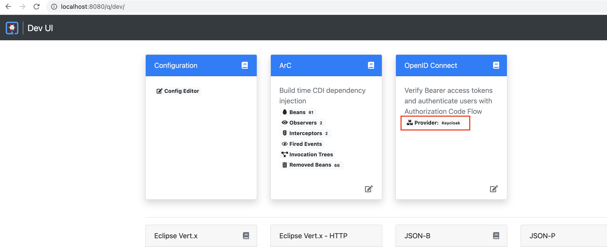
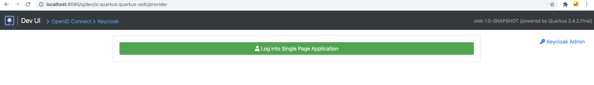
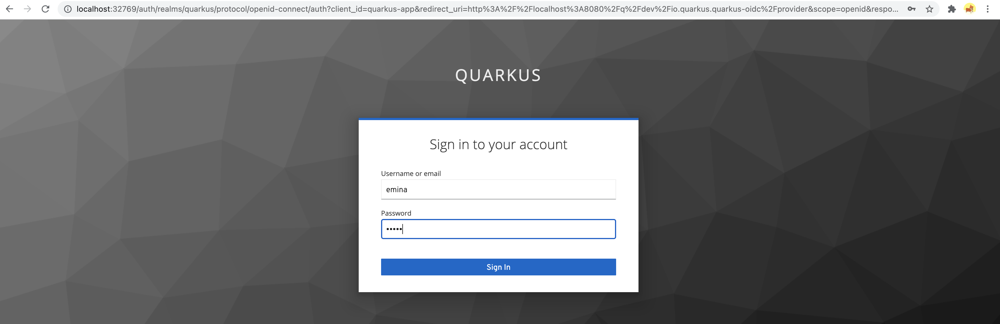
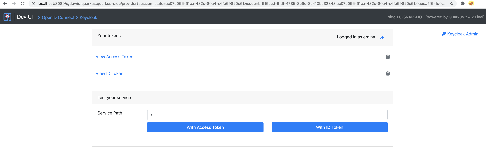
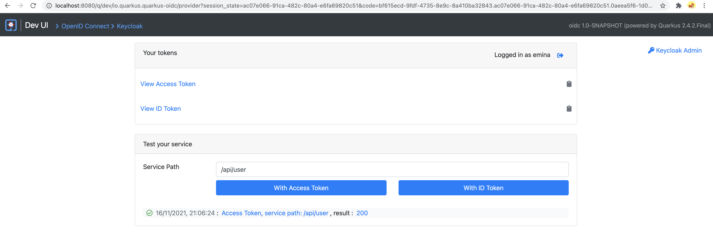
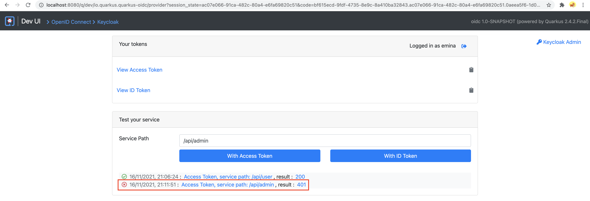
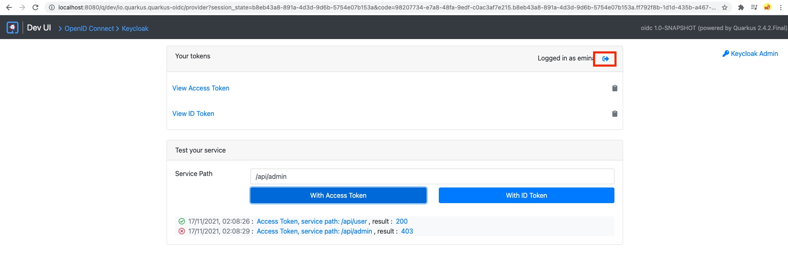
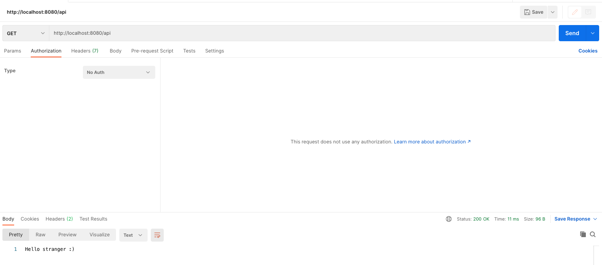

= DevServices am Beispiel Keycloak

https://quarkus.io/guides/dev-services[Quarkus-DevServices]

== Theory

* Erstellt automatisch Containers
* Nur im dev- und testmode
* Nur die Extention hinzufügen, die man sowieso hinzufügen würde

== Integration von Keycloak

https://quarkus.io/guides/dev-services#keycloak[DevServices-Keycloak]

[soruce]
----
<dependency>
        <groupId>io.quarkus</groupId>
        <artifactId>quarkus-keycloak-authorization</artifactId>
</dependency>
----

== Keycloak starten

Ich habe mich dazu entschieden DevServices zu benutzen und daher muss man nur mit dem Command

[source]
----
./mvn clean compile quarkus:dev
----

Da ich hier den dev-scope angebe, wird automatisch ein Keycloak-DockerContainer gestartet (ohne Konfiguration werden 2 User erstellt: alice, bob)

== Configuration

Falls man eigene Benutzer erstellen möchte, muss man im File "application.properties" folgende Konfigurationen setzten:

[source]
----
quarkus.keycloak.devservices.users.emina=emina
quarkus.keycloak.devservices.users.admin=admin
quarkus.keycloak.devservices.roles.emina=user
quarkus.keycloak.devservices.roles.admin=admin
----

Damit ich erstelle ich 2 Benutzer (emina und admin).

=== emina

Passwort: emina

Rollen: user

=== admin

Passwort: admin

Rollen: admin

== Tested

Da ich DevServices benutze kann man unter der Dev UI page (http://localhost:8080/q/dev/) -> OpenID Connect -> Provider:Keycloak einen Auth-Token generieren und damit sofort die Endpoints testen.

Mit einem Click auf "Log into Single Page Application" wird man auf die Keycloak-Anmeldeseite weitergeleitet und kann sich entweder mit dem User

* emina -> emina
* admin -> admin

anmelden.

Darauf hin wird man auf die Testseite weitergeleitet, wo man unter "Service Path" den Pfad zum Endpoint angeben kann und dann mit einem Klick auf "With Access Token" einen Request abschicken kann.

Pfade:

[source]
----
/api/admin -> Nur für Users mit der Rolle "admin"
/api/user -> Für Users mit der Rolle "admin" oder "user"
/api -> Öffentlicher endpoint
----

Da der Benutzer "emina" angemeldet ist, erscheint ein Fehler beim Versuch auf den "/api/admin" Endpoint zuzugreifen.

Um dann diesen Endpoint zu testen, muss sich der Benutzer abmelden und mit dem Benutzer "admin" anmelden.
Das Testen danach funktioniert genau wie davor.

Zum Testen vom anonymem Endpoint, benutze ich Postman.

